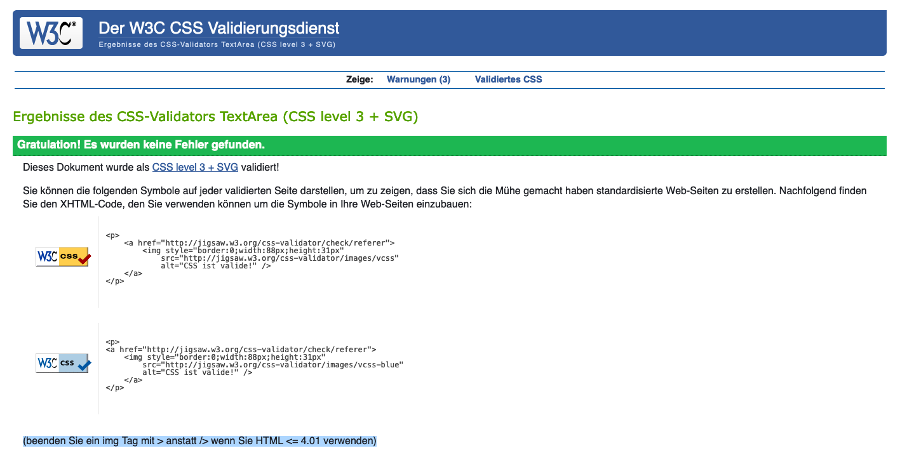

# Welcome to the ChaChaCha-Teacher Website,

You want to learn how to dance the ChaChaCha? Then my website is the place to go. In an interactive game the users can learn the basic dancing steps with or without music, pause as they choose, shuffle through the provided music and track their practice time.

In an initial step the users are asked whether they want to learn the leading steps of the dance or the non-leading steps. Then they are directed to the according subpage where the dancing fun starts. 

The site is targeted at users who have no or only minimum knowledge of the ChaChaCha dance and need to learn the basics fast and uncomplicated. They might have a wedding, school dance or party coming up where they have to dance or should be able to. If time is too short to book a live dancing class or maybe the users want to save the cash, ChaChaCha Teacher is the place they go to.

# Responsiveness
All three pages are responsive as shown below.

## Main Page

## Leading Steps Page

## Non-Leading Steps Page

# Features Overall

## Navigation Bar
On top of each page there is a navigation bar allowing the user to get back to the main page or switch between the two different virtual dancefloors (leading steps and non-leading steps).

## Footer
Following the feedback of the first submission I added a footer with social media icons to the main page and the subpages. Since ChaChaCha Teacher does not exist and therefore there are no social media channels, the icons lead to the general social media pages.

# Features Main Page

## Intro Box
The introbox consists of a heading that is quickly caught by the eye of the user so they know the name of the game. Furthermore, the users are informed what the game is about and given an initial choice depending on whether they want to learn the leading or non-leading steps.

# Features Subpages

## Subpages Title and Background
The title of the subpage consists of the name of the game (ChaChaChaTeacher) and the chosen steps (leading or non-leading). This is important for the user to know where in the game they are and what they are about to learn. Furthermore, the different backgrounds underline if the users are on the page of leading steps (usually men) or non-leading steps (usually women).

## Dancefloor
The dancefloor is split into 3 parts. 

## Testing Steps
The ChaChaCha Teacher provides testing steps for male and female users. The steps are a sequence of 8 steps. The male and female steps complement each other. So the male start with the left foot while the women start with the right foot. This logic is followed through out the sequences.

 

### Music Panel

First, there is the music panel where the users can mute and shuffle music. When the users click the mute button to stop the music, the button turns red. If they click again to continue with music, the button will turn into its original grey color.

### Steps Area

Secondly, there is the steps area with a default steps picture at the beginning. This pic is supposed to give the users a glimpse of what to expect of the animation and also to teach them how to initially put their feet.

### Start Panel

Thirdly, the start panel.

Here, the user can start and pause the teaching session. When pressing the start button a 3 seconds countdown will show and give the user time to get ready to dance. 

The practice time starts and music already sets in so the users have time to register the music and its speed. 

The speed of the music was chosen slowly on purpose to fit beginners purposes. As a last step the 8 steps sequence starts playing. It will repeat until the users press the pause button or leave the page.

When the users click the pause button the music and animation stops and the word 'Stopped' is showing in the middle of the steps section. Thus, the users know that they indeed stopped the game.

# Features left to implement

There are a few features that could be implemented in the future:

-  more types of dances (renaming the game to 'Dance Teacher')

-  a two-player mode where the users can practice side by side

-  add different difficulty levels 

- add the possibility to play with usernames, tracking and ranking the best players by practice time and/or levels completed

# Testing

Throughout the coding process I did test and debug the code over and over, trying different features and ways to get them going best. This is also visible in the commit protocol. 

## Central Debugging Cases - Stage 1 (submission 1)

### Timeout 
When starting the project I had a clear vision of looping through an array of pictures in my head. Little did I know how complex this would get.
A main learning was that without a Timeout the pictures are shown too fast and the users will not be able to comprehend. Thanks to my mentor on helping me solve that problem.

### Indexing Multiple Times
Initially starting with a for loop, I soon realized that another approach might be more efficient. Looping through the array multiple times was not possible in the first version I had. Instead it stopped after 8 steps and the music continued playing. A pity. So I changed the function changeStepImage, added an index with modulator. By calling the function at the end again, refering to that index and adding a +1 to it, the magic was done.

### Making the Steps Stop
While stopping the music was quite straight forward, considering there are pre-defined functions to pause and play music, I had quite a hard time figuring out how to stop the iterating pic array once started. I tried first to connect it to whether the music was playing or not. So,  the steps should only play if the music is playing ( if not muted, not ended, not paused). But I couldn't make that work and I figured a more straightforward approach was needed.

I read in more detail about the setTimeout function and its clearTimeout function. I realized that I needed to clear the Timeout to make the steps stop. At the same time I wanted the user to know that they stopped the steps that's why I integrated the message with an innerHTML.

### Making the Counter Work
The counter didn't work until my mentor pointed out that I needed the setInterval function to make it work.

Another challenge with the counter was the positioning as a layer over the steps. First I tried to solve it with the z-index but eventuelly with the position property it was much easier.

### Setting up the Practice Time
The idea for the practice time came from one of the classes examples. I actually thought it would be copy/paste but I wanted the feature to work onclick not as soon as the page loaded. So I needed to adapt the code. My mentor helped me here by pointing out the parseInt function to me which converts string to integers.

### Coloring the Mute Button
The idea behind coloring the button on click was to give the button a status (red or grey) and depending on that status the program knows what to do (e.g. play music, stop music). And I was right, from the time the color worked, the music stopped due to the according function.

### Shuffle Music
The shuffle button was the only code that really turned out exactly as I thought of it before. I knew I would need Math.floor and Math.random and that is exactly how it turned out. When addressing the array I made a mistake my mentor found and explained to me: Never address the array, address the variable representing each single element of the array.

## Central Debugging Cases - Stage 2 (submission 2)
For the second submission of the project 2 I worked on the following issues:

### Issue 1: The pause button on the non-leading steps page is not functional.
The bug was based on two issues:
a) there was a typo in the array for the women steps.
b) the variable TimeOutRef was defined twice - as a global and local variable. 
The problems were solved by fixing the typo and deleting the local variable definition.

### Issue 2: Console errors upon hitting the volume button and shuffle button on leading and non-leading steps pages. 
The buttons were not covering every user interaction yet. I was not considering that any user would click the shuffle or mute button before the music even started. This caused issues in the console. 
This problem was fixed with the help of my mentor. In the javascript files we added an if loop in the functions onPause, shufflemusic and unmute. In the html files we added 'disabled=true' to the buttons shuffle music and mute/unmute. Thus, the buttons were disabled by default. To enable and disable the buttons depending on their current status we created two more functions in the Javascript file enableMusicControls and disableMusicControls.

### Issue 3 (mentor motivated): The practice time did not stop when the pause button was pushed    
We cleared the interval for the variable downloadTimeRef in the function onPause and integrated the practice time in the pause function in that way.

### Issue 4 (self motivated): When pushed multiple times the start button triggered playing multiple music at one
An issue even more apparent once Issue 2 and 3 were solved: the start button pushed multiple times played multiple music pieces at once. I myself searched for a fitting solution to the problem. Following the example of the mute and shuffle button, I disabled the start button after its first click and only clicking the pause button can enable the start button again. 

### Issue 5: There are console errors thrown as well while interacting with the application that need to be fixed.
After fixing issues 1 to 4, there were no console errors visible (except for the missing favicons). So I pointed the feedback out to my mentor. He checked and also didn't find any further issues. So this issue should be fixed as well.

### Issue 6 (assessor comment): The readme should include the feature testing steps. 
This was a feedback of the assessor. I hope I understood the requirement right, since it wasn't elaborated further but seemingly mentioned in passing. The feature testing steps was added to the feature section of this read me file.

### Issue 7 (assessor comment): The favicon and social media links should also be added. 
The favicons for the main page and the two subpages (leading steps and non-leading steps) were added.
Social media icons for instagram, facebook and twitter were added. Since the ChaChaCha Teacher doesn't really exist and therefore doesn't have any social media channels, the links of the icons go to the main social media pages.

## Validators

The Validators were used for both the stage 1 (1st submission) and the stage 2 (2nd submission.)

### HTML - Stage 1
The main page and the subpages were tested with the WRC validator for HTML and no errors occured.

### Main Page

### Leading Steps

### Non-Leading Steps

### CSS - Stage 1
The main page and the subpages were tested with the (jigsaw) validator for CSS and no errors occured.

### Main Page

### Leading Steps

### Non-Leading Steps

### Javascript - Stage 1
The two javascript files were tested with the Jshint validator. No errors were found. 

### JS Men

### JS Women

### HTML - Stage 2 (2nd submission)
The main page and the subpages were tested with the WRC validator for HTML.

### Main Page
For the main page no errors were detected with WRC validator.

### Leading Steps
For the subpages the WRC validator says that the attribute disabled has a bad value with 'true'. This appears as an error. Since my mentor himself suggested this approach I will leave it like this. I don't see why this should not be ok. 

### Non-Leading Steps
For the subpages the WRC validator says that the attribute disabled has a bad value with 'true'. This appears as an error. Since my mentor himself suggested this approach I will leave it like this. I don't see why this should not be ok. 

### CSS - Stage 2 (2nd submission)
The main page and the subpages were tested with the (jigsaw) validator for CSS and no errors occured.

### Main Page

Warnings

The warnings above were evaluated and disregarded due to its irrelevance. The first warning says that with direct entry of CSS the imported style sheets are not tested. This doesn't because I test each imported file separately. The second warning says that font names should always have double quotation marks. I checked it and my CSS is clean, this might be a bug of the validator. The third warning says that the -ms-transform is not known by this validator. No reasons to delete it, since the css command doesn't cause any problems and is needed for the code.

### Subpages Steps

Warnings

The warning above was evaluated and disregarded due to its irrelevance. The  warning says that with direct entry of CSS the imported style sheets are not tested. This doesn't because I test each imported file separately.

### Javascript - Stage 2 (2nd submission)
The two javascript files were tested with the Jshint validator. No errors were found. 

### JS Men

### JS Women

# Main Learnings
## Number of Functions
I had like 6 functions on my first draft only to have many, many more in the end. I realized that some concepts I had in my mind for one function were too complex or just required sub-functions. Like e.g. having 2 functions for the random shuffle - 1 function to generate the random number and one to execute the shuffle. Due to easier readability and structure I added functions were needed.

## Properties vs Functions
In one if else statement I tried to write a condition connected to a function. A big no, no. Never use functions for conditions, use properties.

## Array vs Element
When doing the shuffle function and the iteration through the picture array I addressed the array itself. My mentor told me that I always need to address the variable representing the single elements of an array.

## Understanding the Difference Between onclick and addEventListener
I played around a lot with calling functions on click. Thereby I tested the two possible ways 'on click' and 'addEventListener'. I realized that 'onclick' overwrites if used multiple times and addEventListener can actually be used on one button multiple times.

## Understanding the Difference Between setTimeout and setInterval
When trying to solve my problem of stopping the steps on pause click, I read a lot about setTimeout and setInterval, watched videos and got behind their systematic. They will definitely be very helpful in the future. I have new project ideas already.

## Calling Multiple Functions at Once
Pretty early on in the project I realized that pressing the start button will have to do multiple things:
- run a counter
- start the music
- load the pic array 
- start the practice time

Although I think it was mentioned in the class that one function can call on other functions, I realized how crucial this is when starting to code my start button features. I also realized in that context how important a clear structure and naming of functions is.

## Considering all options a user may have (stage 2)
The buttons start, pause, mute and shuffle could also be used in a way not intended by me. These options need to be considered and solved (e.g. through disabling buttons when they shouldn't be used.)

# Deployment
The project ChaChaCha Teacher was deployed using GitHub pages. Therefore, I went to the GitHub website and:
- picked the repository 
- clicked on settings
- choose the tab 'pages'
- in the source section I clicked on the drop-down menu, choose main and clicked save

The website refreshed revealing the link to the published page which you can find here:
https://andreagorsche.github.io/chachach-_teacher/

# Credits

## Mentor Help
The concept and writing of the code was done by me. My mentor helped me significantly in understanding the Javascript logic, especially in the following parts (also mentioned in the deployment section):
- addressing music in array (via variable)
- showing me how to use setInterval and setTimeout to make the practice time, the counter and my steps array work out
- introducting me to parseInt without which the practice time display wouldn't have happend
- connecting my clicked function to the mute button and making the muting work properly without an if else statement
- helping me with logic mistakes in the code
- helping me out in a second session to fix interaction problems with the buttons in use

I am aware that the variables are supposed to stay local in this project. All the variables that were set global were discussed with my mentor and he recommended doing so. He didn't see a problem because they all function as constants.

## Code from Class
The code for the practice time was very much inspired by a code sample from the course. Like explained in the debugging section the code needed adaption, still referencing it here.

Special thanks to my mentor who always makes the most out of our sessions.

## Pictures

The background pictures and also the initial step pic were taken from Pixabay for free. It can be used without further reference, also commercially.

## Steps for animation
The dancing steps for the array (moving yellow steps) were done by me in Photoshop based on the step pic from Pixabay.

## Music
The three songs were taken from bensound.com a platform for free music use. It can be used without further reference.